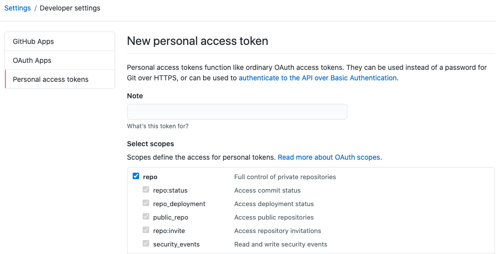
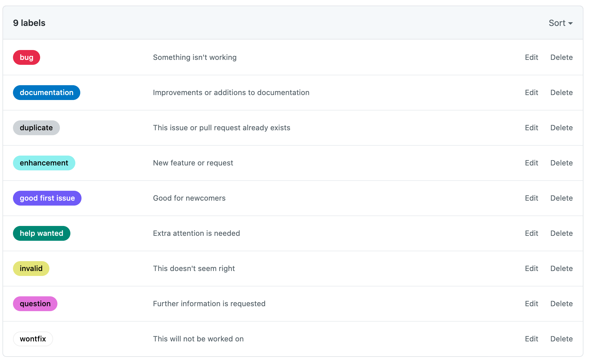
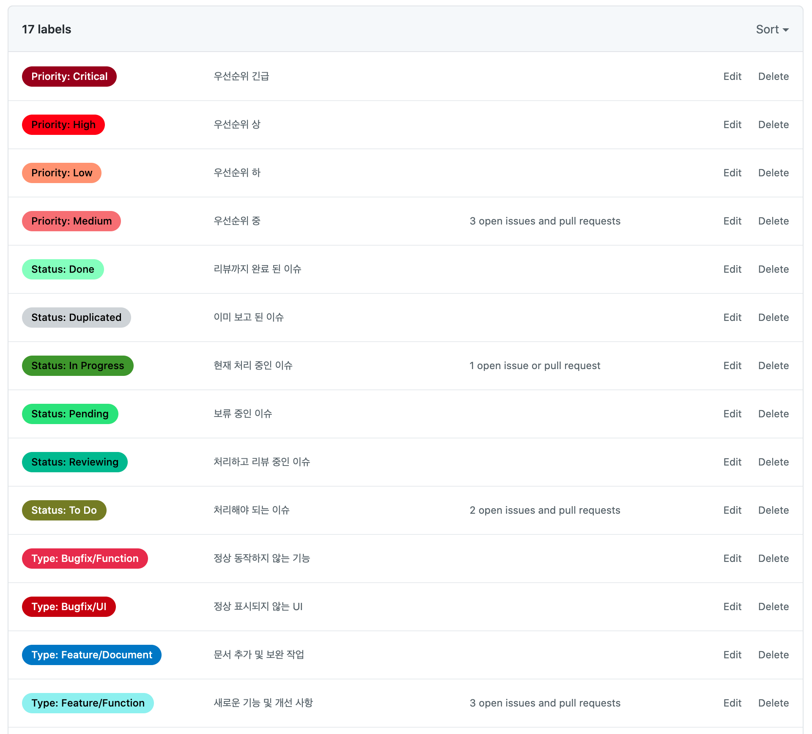

# Github Label 세팅

## Label 이란?
- Issue, PR 에 붙여서 분류하기 위한 이름표

## Github 액세스 토큰 발급
[https://github.com/settings/tokens](https://github.com/settings/tokens)
- `Generate new token` 클릭
- 원하는 이름 입력
- `scopes`에서 repo 선택



## Label 정의하기
- `labels.json` 파일에 JSON Array 형태로 정의
- `name`, `color`, `description` 을 정의할 수 있음
```json
[
  {
    "name": "Priority: Critical",
    "color": "8c001a",
    "description": "우선순위 긴급"
  }
]
```

## 정의 된 Label 적용하기
- `액세스 토큰`, `계정명`, `저장소 이름`을 자신의 것으로 변경
```sh
npx github-label-sync --access-token [액세스 토큰] --labels labels.json [계정명]/[저장소 이름]
```

### Label 설정 적용 전


### Label 적용 후



# Issue Template
`Issues` 탭에서 `New issue` 버튼을 눌렀을 때 미리 정의 된 템플릿을 선택할 수 있음

## Issue Template 정의하기
- 마크다운 형식으로 파일 생성
- `name`, `about`, `title`, `labels`, `assignees`를 미리 지정할 수 있음
- labels 의 경우 위에서 정의 한 label name을 지정하면 됨 

## 예시
```markdown
---
name: Hotfix Template
about: Hotfix가 필요한 작업에 대한 템플릿입니다.
title: 'fix: '
labels: 'Status: To Do, Priority: Medium, Type: Bugfix/Function, Type: Bugfix/UI'
assignees: ''

---

> Hotfix pull-request의 경우에는 squash merge가 이루어 질 예정입니다.
> Issue 타이틀이 커밋 메세지로 변환되니 주의해서 작성해주세요.

## 설명
어떤 문제가 있는지 명확하게 설명해주세요.

## 작업 예정사항

```

## Issue Template 적용
- 추가 된 파일을 github 원격에 push 한 후 `New issue` 버튼을 누르게 되면 아래와 같이 선택 화면이 나옴


# Pull Request Template
- 마크다운 형식으로 파일 생성
- `pull_request_template.md`로 파일 이름 지정

## 예시
```markdown
## 이슈번호

> 이슈번호를 기재합니다. 
> eg. Resolved #90

## 개요 :mag:

> 어떤 이유에서 이 PR을 시작하게 됐는지에 대한 히스토리를 기재합니다.

## 작업사항 :memo:

> 해당 이슈사항을 해결하기 위해 어떤 작업을 했는지 기재합니다.

## 테스트 방법(Optional)

> 리뷰하는 사람이 어떻게 테스트할 수 있을지 간략히 기재합니다.

```

## Pull Request Template 적용


# 참고
- [github-label-sync](https://github.com/Financial-Times/github-label-sync)
- [Using templates to encourage useful issues and pull requests](https://docs.github.com/en/free-pro-team@latest/github/building-a-strong-community/using-templates-to-encourage-useful-issues-and-pull-requests)
